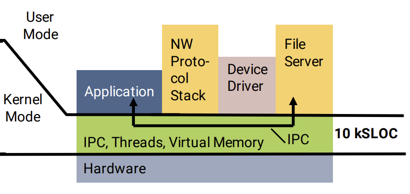
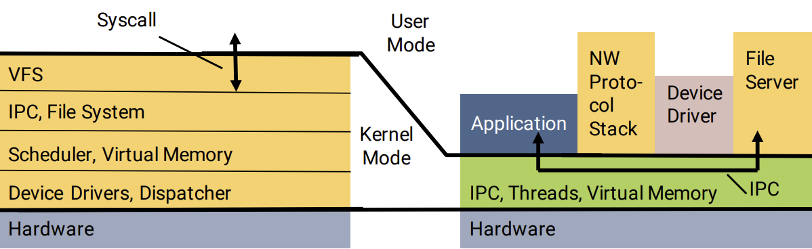
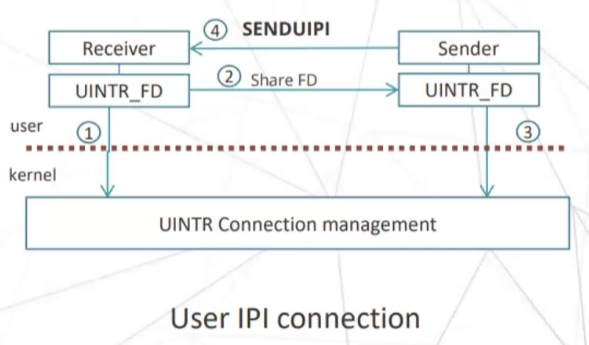
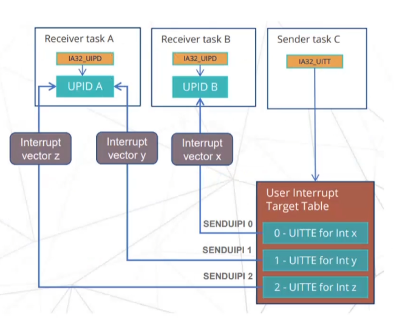
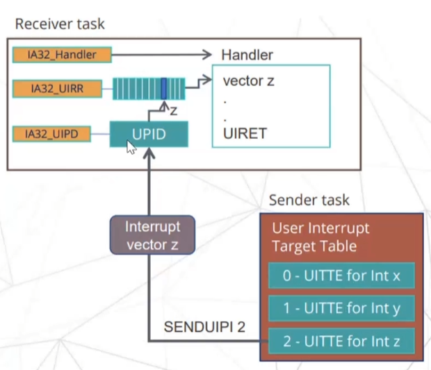

# 第二章：预备概念与技术
## 2.1 微内核
### 2.1.1 微内核的基本概念
微内核的核心思想是将操作系统的核心功能最小化，是一种将原有概念中的操作系统内核中的基本功能保留在现有内核，而将不需要在内核态运行的功能都放置到用户态运行的设计结构。

如图所示，微内核将原有的操作系统服务划分为两大部分：微内核和多个用户态服务器。微内核是指能实现操作系统最基本的核心功能的小型内核，它通常包含与硬件处理紧密相关的部分以及一些基本功能，诸如进程（线程）管理、进程通信和内存管理等。操作系统中的绝大部分功能，如网络协议栈、设备驱动以及文件系统，都放在微内核外的一组服务器中实现，作为用户进程独立运行在用户态。而客户端和服务器的通信借助微内核提供的进程通信机制进行交互。  
### 2.1.2 微内核的基本功能和特点
微内核通常具有以下功能：
1. 进程（线程）管理：进程（线程）之间的通信功能是操作系统最基本的功能，此外还有进程的切换、进程的调度以及多处理机之间的同步等功能，都应放入微内核。
2. 低级存储器管理：微内核只实现最基本的低级存储器管理机制，如用于实现将虚拟地址变换为物理地址的页表机制和地址变换机制，这一部分依赖于硬件，需要在微内核中实现。
3. 中断和陷入处理：中断和陷入与硬件紧密相关，在这方面微内核的主要功能是捕获所发生的中断和陷入事件，并对其进行响应处理。在识别中断或陷入事件后，微内核将请求发送给相应的服务器处理。

基于微内核的概念和基本功能分析可知，微内核的主要优点如下：
1. 扩展性和灵活性：操作系统的许多功能从内核中分离出来，在用户空间实现，因此当需要修改某些功能或增加新功能时，无需改动内核代码。
2. 可靠性和安全性：只有微内核运行在内核态，而服务进程在用户空间运行，因此系统的不同部分可以独立开发、测试、更新和失败，不会影响到核心的稳定性。
3. 可移植性：在微内核设计中，仅有CPU和I/O硬件相关的代码运行在内核中，而其他服务器均与硬件无关，硬件依赖性较低的核心更容易移植到新的硬件平台上。
4. 支持分布式计算：客户端和服务器之间、服务器和服务器之间的通信采用内核提供的进程通信机制，这使得微内核系统能很好地支持分布式系统和网络系统。

然而，微内核也有其劣势，其中最主要的是性能问题。由于大多数服务都运行在用户空间，核心与服务之间频繁的上下文切换和消息传递可能导致性能下降。尽管如此，随着计算机科学的发展和消息传递技术的改进，许多现代微内核如L4、Minix3等已经显著优化了性能，使其更接近实际应用的需求。

总体而言，微内核提供了一种更安全、更灵活且易于管理的系统架构方法，尽管其在性能方面可能存在一些折衷。
### 2.1.3 微内核与宏内核的对比
微内核（Microkernel）和宏内核（Monolithic kernel）是两种主流的操作系统内核架构，它们各有特点和优势，适用于不同的系统需求和应用场景。

宏内核是一种传统的内核设计方式，如图左侧所示，它将大量的系统服务和管理功能集成到一个庞大且复杂的内核空间中。这包括进程调度、文件系统、网络协议、设备驱动、内存管理等核心服务。由于系统组件都在内核空间运行，它们可以直接访问硬件和系统资源，这样的集成提供了高效的性能和直接的资源管理优势。宏内核的一个典型例子是Linux内核。

而如右图所示微内核设计则采用了一种截然不同的方法。它仅在内核中实现最基本的服务，如最低级的进程和内存管理、通信机制等，而将其他服务如文件系统、网络服务等移到用户空间以独立的服务进程运行。

相较于微内核的性能缺陷，宏内核的主要优点在于其高效的性能。由于所有关键的服务和驱动程序都在内核空间内直接执行，它们之间的通信和数据交换延迟较低。此外，这种集成方式减少了系统在执行核心任务时的上下文切换，从而优化了操作的速度和响应时间。

然而，宏内核的缺点也是显而易见的。其复杂性导致维护和更新困难，因为任何一个组件的更改或错误都可能影响到整个系统的稳定性。此外，宏内核由于其庞大的代码基和复杂的结构，通常更容易受到安全威胁。这与微内核的安全性和服务的隔离性是相对应的。

总体而言，宏内核因其性能优势适用于对响应速度和资源管理要求极高的环境，如桌面操作系统。而微内核则因其高度的模块化、安全性和可维护性而适用于需要高可靠性和安全性的环境，如实时、工业、航空和军事等对可靠性要求极高的关键任务领域。
## 2.2 用户态中断
### 2.2.1 用户态中断简介
传统操作系统的进程通信可以大致分为两类：一类为进程间通过操作系统内核提供的接口（如管道、信号）进行通信，另一类是在基于用户态进程中通过共享内存进行通信。
通过操作系统内核的接口进行通信会带来上下文切换开销，系统吞吐量低，但这种方法CPU占用低。而通过共享内存进行通信无切换开销，系统吞吐量高，但需要循环检查消息是否到来，CPU存在忙等现象，占用高。
为了提升操作系统IPC性能，可以使用硬件机制，由硬件切换进程上下文，无需陷入，但需要增加硬件以及修改操作系统。为此引入用户态中断的机制，使得用户程序在处理中断时不需要陷入内核。
### 2.2.2 用户态中断工作流程
如图所示，用户态中断的运行主要有三个部分参与：

首先是接收方：接收方为一个用户态程序，它的作用在于向操作系统注册用户态中断处理程序，并注册用户态中断向量为用户态中断接收方。此后操作系统会返回唯一的标识符，接收方将标识符封装为文件描述符FD（File Descriptor），通过分享文件描述符FD的形式将标识符告知发送方。告知标识符的过程可采用父子进程的继承方式或者或者通过socket传送。

其次发送方：发送方为一个用户态或内核态进程，它的作用在于在接收接收方共享的文件描述符获取标识符后，使用标识符向操作系统将自己注册为接收方，并通过操作系统返回的索引和SENDUIPI指令发送用户态中断。

最后是操作系统内核：操作系统内核维护发送方和接收方在收发用户态终端过程中必要的数据结构，如标识符和索引表等，并负责在发送方发送中断时将中断内容写入硬件，而硬件向目标进程发送中断。

### 2.2.3 用户态中断具体实现
如图所示，为实现用户态中断，首先在操作系统中引入两个新的数据结构UPID（Usermode-Interrupt Posted Interrupt Descriptor，用户态中断描述符）和UITT（Usermode-Interrupt Target Table，用户态中断目标表）。每一个注册了用户态中断接收端的任务都会被映射到一个唯一的UPID。在注册了发送端的任务中都会维护一个UITT结构，表中的每一项被称为UITTE（Usermode-Interrupt Target Table Entry），每一个UITTE对应唯一的一个用户态中断向量，而每个中断向量可以被映射到一个UPID。

在上述新增数据结构的基础上，发送方执行SENDUIPI指令后，硬件首先通过指令传入的中断索引，从UITT表中找到对应的UITTE，并获得中断接收方的UPID。在此之后，一个包含着中断向量的UIPI中断被硬件发出到目标CPU并将其写入UPID的目标位。目标CPU收到并识别UIPI中断，若目标任务处于运行状态，则调用中断处理函数执行中断的处理（处理函数运行在用户态），处理完成后使用UITRET用户态中断返回指令返回正常的执行流。

## 2.3 Rust与Rust异步编程  
系统编程领域是一个需要高效利用硬件、同时关注代码安全性和可维护性的情境。而Rust语言的所有权和生命周期系统使得在编写系统级代码时更容易保障内存安全，减少潜在的漏洞和错误，其次，Rust提供了零成本抽象，使得开发者可以使用高层次的抽象，而无需担心性能问题。更重要的是，Rust的所有权和借用系统帮助避免了共享数据的并发问题，而其高级的并发库（如async/await）使得编写并发和并行代码更为容易。总体而言，Rust的特性使其成为一种安全、高性能、并发友好且具备现代化工具链的系统编程语言。因此本选题使用Rust语言在完全兼容seL4内核基本功能的微内核ReL4上开发基于用户态中断的系统调用。