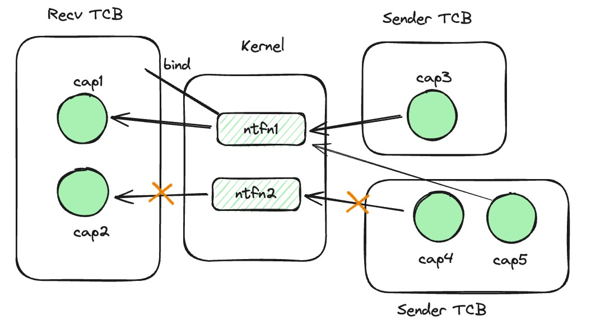

# 第三章：reL4微内核介绍
## 3.1 reL4简介

reL4起源于seL4（Secure Embedded L4），seL4是一个高度安全的微内核，是L4微内核家族的成员，其设计目标是为了提供最高级别的安全性。seL4不仅作为一个操作系统内核，还在安全关键性应用中发挥着重要作用，如防御系统、汽车电子、航空电子和其他嵌入式系统领域。

seL4的一个显著特点是它是世界上第一个完全经形式验证的操作系统内核。形式验证是一个使用数学方法验证软件或硬件系统符合其规格说明的过程。这意味着seL4的实现被证明与其形式化的规格说明完全一致，保证了没有任何功能性错误，并且确保它完全按照设计的安全政策工作。这种级别的验证带来了前所未有的安全性保证。

此外，seL4使用一种称为Capability的机制来控制对系统资源的访问。Capability机制是一种seL4的核心安全特性，用于精确控制系统资源的访问权限，以提供强大的访问控制和细粒度的权限管理，从而增强系统的安全性和可靠性。

通过形式化验证和Capability机制提供的强大的安全特性和隔离性，seL4为需要高度安全性的系统提供了一个可靠的基础，特别是在越来越多的设备连接到互联网的今天，这种安全性变得尤为重要。虽然最初设计用于嵌入式和安全关键系统，seL4也被移植到了多种平台上，包括x86、ARM和RISC-V架构。

而Rust语言是一种安全、高性能、并发友好且具备现代化工具链的系统编程语言，可以为系统编程带来更高的效率和安全性，因此reL4的开发者使用Rust语言重写了seL4的大部分内容，使得reL4成为了支持seL4在RISCV上的系统调用的微内核，且在内核结构和实现机制上采用与seL4相似的方法。reL4 提供的核心功能如下：

- 进程和线程管理：reL4 提供基本的进程管理功能，允许创建、执行、管理和终止进程和线程。它通过线程控制块（Thread Control Block，TCB）管理线程的执行。
- Capability系统：与seL4一致，reL4 的安全性很大程度上依赖于其Capability访问控制模型。具体而言，Capability是一种代表某种权限的标识符，它允许持有者对特定的系统资源（如内存页面、通信端点、线程等）进行操作。在reL4中，每个资源都与一个或多个能力绑定，而这些能力存储在所谓的CSpace（能力空间）中，每个进程拥有自己的CSpace。
- 内存管理：内存管理在 reL4 中是通过两种主要机制实现的：内存分配和内存保护。reL4 同样使用 CSpace 来控制对内存的访问，每个进程拥有自己的 CSpace 的特性保证了内存访问的安全性。
- 通信机制：reL4 的 IPC（Inter-Process Communication，进程间通信）机制主要是通过端点（endpoint）和通知（notification）对象来完成的，它们允许线程之间的同步和异步通信。
- 隔离和安全：通过上述的Capability系统和精细的资源管理，reL4 实现了高级别的隔离。在 reL4 中，不同的应用和服务可以在同一硬件平台上安全地并行运行，相互之间无法访问或干扰。
- 定时器和调度：reL4 提供了基础的调度器支持，允许系统调度器管理线程的执行时间和顺序。此外，它还支持定时器管理，使系统和应用能够计划任务和管理时间。

reL4 通过Rust语言安全性的加持和这些核心功能和设计模式，实现了一个安全、可靠且响应迅速的操作系统平台。但虽然在框架和机制实现上借鉴了seL4的设计方法，但是由于开发时间有限，reL4并没有通过形式化验证的方式来确保代码运行的可靠性。因此在安全性方面，reL4无法保证没有任何功能性错误，也无法实现与seL4一致的安全性保证。此外，不同于seL4 提供了一层硬件抽象以使得内核可以在多种硬件平台上运行，包括 ARM, x86 和 RISC-V，reL4仅支持seL4在RISC-V架构上的系统调用，因此只支持在RISC-V架构上运行上运行，这也限制了reL4的实际运用范围，在未来的发展中reL4或许应考虑参照seL4的抽象方法对更多硬件平台进行支持。

在实际应用中，reL4 可以作为微内核提供基本的硬件隔离和基础服务，配合用户态服务器搭建操作系统。此外，reL4也可以作为虚拟机监控器直接管理硬件资源，并提供在其基础上运行其他操作系统的支持，提供最佳性能和资源利用率。这一方案或将可作为未来reL4的发展方向。
## 3.2 reL4项目结构
reL4的项目结构如下所示：

- boot：此模块包含内核启动所需要的函数和数据结构，如堆分配器、内存初始化器等。
- common：此模块包含内核的通用函数、错误处理函数以及用户态内核态交互有关的数据结构。
- cspace：此模块包含Capability机制的具体实现，包括capability的声明、类型和一系列权限控制方法等。
- interrupt：此模块包含中断的识别和处理方法。
- kernel：此模块包含内核代码的连接方法、内核陷入的处理和返回时所需要调用的方法。而在现有reL4中，微内核以同步的方式进行IPC，本模块也包含了具有特定特征消息通信可使用的fastpath通信方法，可以大大提升效率。
- syscall：此模块包含内核系统调用解码和处理所需的函数，以及获取系统调用参数和返回系统调用结果所需的设置寄存器和tcb等的辅助函数。
- task_manager：此模块包含了reL4的task相关内容。首先是reL4的IPC机制，如endpoint和notification对象以及相关通信方法的实现。其次是reL4的线程管理和调度内容，如tcb系列方法的定义以及线程调度器的实现。
- uint：此模块包含了用户态中断的具体实现，内含两个子模块：uintc和uintr。uintc包括了用户态中断的软件实现，包括用户态中断所需的数据结构定义以及发送端和接收端的注册流程。uintr实现了对下层硬件的封装，为用户态中断发送和接收提供了接口。
- vspace：此模块包含reL4的虚存管理系统的实现。
## 3.3 reL4中基于用户态中断的Notification机制
### 3.3.1 总览
在 reL4 微内核中，Notification机制提供基本的同步原语，用于线程之间的通信和事件通知。它的主要作用是允许一个线程通过Capability向其他线程非阻塞地发送信号，以表示某个事件的发生或传达某种状态，实现线程间的协作。与seL4中的Notification机制不同，reL4的Notification机制引入了用户态中断作为硬件支持，提供了一种更为高效且安全的方式来处理线程间的通信和同步问题。

如图所示，在reL4的Notification机制中存在着三个重要角色：接收者线程、notification内核对象以及发送者线程。发送者线程的TCB中维护notification内核对象的capability，并通过此capability进行信号的发送。信号的发送由用户态中断负责。而notification内核对象由一片未初始化的内存初始化而来，通过capability进行访问，并与接收者线程进行一对一绑定。发送者线程的TCB中维护与之绑定的notification内核对象的capability，并通过此capability进行信号的接收，接收后完成处理工作。

需要指出的是，一个notification内核对象只能绑定到一个接收者线程，而一个接收者线程也只能绑定一个notification内核对象。但是，同一个notification内核对象的capability可由不同的发送者线程持有，并可以接受多个不同的发送者线程的发送请求，不同发送者依靠特定的标识符进行区分。
### 3.3.1 注册流程
reL4下的Notification机制的注册需要在发送端和接收端先后进行。

发送端的注册流程如下：
1. 调用seL4_Untyped_Retype，将一片未被使用的内存初始化为一个notification内核对象，并获得对应的capability。
2. 调用seL4_CNode_Mint，从原始的notification内核对象的 capability中派生一个新的被赋予了标记的capability作为发送端的入口。

接收端的注册流程如下：
1. 通过继承或共享内存的方式获取notification内核对象的capability。
2. 调用seL4_TCB_BindNotification，将notification内核对象绑定到本线程，只有被绑定线程可以通过capability来接收此notification内核对象的信号。
3. 调用seL4_Uint_Notification_register_receiver系统调用，来将TCB注册为用户态中断的接收端。

在seL4的Notification机制中，发送端无需注册，只需要获取对应的notification内核对象的capability即可进行发送。在reL4中，考虑到用户态中断的发送端需要注册，为了减少开销和提升性能，在reL4中将用户态中断的发送端注册后移到发送端的第一次发送中。

### 3.3.2 通信流程
在reL4中，作者在用户态的发送线程运行时中维护一个notification内核对象的capability的注册状态表，状态表中维护了capability所对应的本线程的UITT中对应UITTE的索引（记为index）。在此基础上，Notification机制中信号的发送流程如下：
1. 调用 seL4_Signal 系统调用，此系统调用中将首先检查入参的notification内核对象的capability是否注册了发送端，如果没有注册，则会转第2步，否则转第3步。
2. 调用 seL4_Uint_Notification_register_sender 系统调用 注册发送端，从内核态返回 index 用于更新上文所述状态表。
3. 从状态表获取对应的 index 作为入参调用uipi_send方法来发送信号。 

在reL4中，Notification机制中设置了中断处理函数后，则不需要调用额外接口来接收信号。但为了适配原有接口，做了以下修改：
- 对于seL4_Wait接口: 由于用户态中断的相互独占的性质，入参将被忽略，调用 uipi_read() 来读取中断寄存器，如果没有信号，则调用 yield_now().await 切换当前协程。
- 对于seL4_Poll接口：入参将被忽略，调用 uipi_read()直接返回读取结果。
### 3.3.3 作用
在reL4中微内核中，Notification机制除了提供了一种高效且安全的方式来处理线程间的通信和同步问题，还可以作为底层部件本文后续即将实现的异步系统调用和异步IPC功能，帮助我们构建可靠且高效的异步程序。在异步系统调用和异步IPC功能中，Notification机制将被用来在系统调用或IPC处理完成且将结果写入共享内存后唤醒接收者的处理协程。
## 3.4 本章小结
本章主要介绍了异步系统调用的开发平台——reL4操作系统。首先介绍了reL4操作系统内核的基本信息，接着介绍了reL4内核的项目结构和功能，最后介绍了reL4中基于用户态中断的Notification机制。上述工作将为后文的开发和理解做简要铺垫。