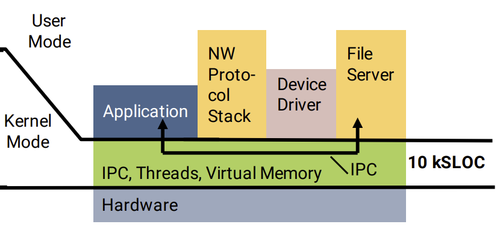
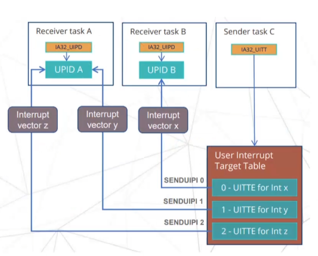
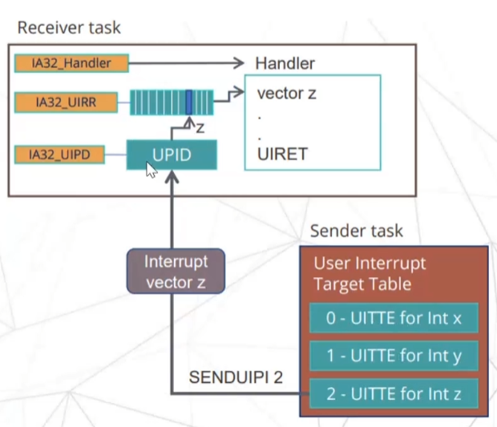

# 第一章：绪论

## 1.1 研究背景及意义

微内核是操作系统内核实现形式之一，它最小化了内核提供的功能：内核负责提供一组通用机制，如进程调度、内存管理等，而运行在用户态的服务器则实现了实际的操作系统服务。应用程序通过进程间通信（IPC）机制与相关服务器通信来获取系统服务。因此，IPC处于任何服务调用的关键路径上，低IPC成本至关重要。

30年前，Liedtke用他的L4内核证明了微内核IPC可以很快，比当代微内核快10-20倍[5]。之后以seL4[1]为代表的微内核的IPC框架也基本延续了最初的L4，以同步IPC作为主要的通信方式，同时引入异步的通知机制来简化多线程程序设计，并提升多核的利用率。

在目前的应用中，微内核的IPC性能已经有了很大的提升，而在IPC较为不频繁的应用中性能已经比较可观。但是在当应用中IPC需求频繁时，以往的IPC方式已经无法满足当代使用条件的需求，IPC的性能已经成为微内核的性能瓶颈，其过高的通讯成本甚至导致了将核心服务移回内核的趋势[2]：首先，微内核将操作系统的大部分服务（如网络协议栈、文件系统等）移到用户态，从而使得IPC数量和频率激增，内核态与用户态之间的上下文切换成为性能瓶颈。其次，现代微内核的外设驱动往往存在于用户态，外设中断被转化为通知信号，需要用户态驱动主动陷入内核来进行接收，这在很大程度上成为了外设驱动的性能瓶颈。

综上，以seL4为代表的现代微内核在IPC和系统调用架构的设计上仍然无法很好满足现代高IPC频率进程的使用需求，本选题旨在调研现代微内核的发展趋势及性能瓶颈，利用用户态中断技术，设计和实现异步系统调用方案，减少微内核的系统调用开销，从而从提升微内核系统的资源利用率、系统调用时延和吞吐率。   

## 1.2 国内外研究现状

现代微内核的大部分IPC优化始于Liedtke提出的L4操作系统概念[1]。而以seL4为代表的现代微内核继承了L4的大部分优化手段，然而随着硬件的发展和软件需求的改变，部分优化方法已经无法适应硬件的发展和软件需求的变更，逐渐被遗弃和改进。目前的国内外在L4的基础上对于现代微内核IPC性能优化提升的研究主要可以分为以下三类：多核利用率、减少内核路径和减少特权级切换开销。  

### 1.2.1 提升多核利用率

在提升多核利用率方面，现代微内核多采用同步IPC的方式进行通信，最初的L4支持同步（交会式）IPC作为唯一的通信、同步和信号机制。而L4-embedded[6]通过添加Notification（一种简单的、非阻塞的信号机制）解决了L4具有的在多线程方面的复杂性问题。Notification不是异步IPC，而是将同步与通信进行解耦，对于有效利用硬件的并发性至关重要。后来的seL4也保留了同步IPC的模型，并通过进一步改进了Notification机制。OKL4已经完全放弃了同步IPC，取而代之的是虚拟IRQ（类似于通知）。NOVA通过计数信号量增强了同步IPC，而Fiasco.OC也通过虚拟IRQ增强了同步IPC[2]。  

### 1.2.2 减少内核路径

在减少内核路径方面，原始的短消息传递采用物理消息寄存器，通过内核切换上下文时不更改消息寄存器的情况下进行。而Pistachio引入了虚拟消息寄存器的概念：将其中一些虚拟寄存器映射到物理寄存器，其余的则包含每个线程地址空间的固定部分中。而seL4和Fiasco.OC继续使用这种方法[2]。此模型优势在于，虚拟消息寄存器大大提高了跨架构的可移植性且减少了中等大小的消息超过物理寄存器数量的性能损失。而对于较长的消息，在原始L4中，“长”消息可以在单个IPC调用中指定多个缓冲区，以摊销硬件和上下文切换成本。但由于存在潜在的巨大的内核处理嵌套异常开销以及在实践中使用率低，长消息的方式在sel4中被弃用。  

### 1.2.2 减少特权级切换开销

在减少特权级切换开销方面，特权级的切换开销主要分为两类[7]：第一类是直接开销，主要是保存和恢复寄存器、模式切换等产生的开销。第二类则是间接开销，主要就是系统调用造成的L1 缓存污染以及快表（TLB）缓存失效等。原始的L4微内核敏锐地把握到了最常用的IPC组合模式（C/S模式），将Send & Recv两个系统调用组合为一个系统调用Call，同时将Recv & Send两个系统调用组合为一个系统调用RecvReply，通过组合系统调用的方式来减少特权级的切换次数[5]。此外，随着硬件的发展，ASID机制[8]被现代微内核用来减少TLB缓存失效问题，有效减小了页表的切换开销。

基于L4的各种现代微内核的实现来看，随着对内核路径的优化逐步达到顶峰，对特权级切换开销的优化已经成为微内核中IPC优化的主要方向，特别是对于有频繁的短消息IPC以及频繁系统调用的应用，用户态-内核态的上下文切换已经成为了限制系统性能的最大瓶颈。  

### 1.2.2 基于用户态中断的改进方案

而随着硬件的不断发展，用户态中断——一种新兴的硬件技术方案逐渐被各个硬件平台（x86、RISC-V）采纳。用户态中断通过硬件的方式，在无需陷入内核的情况下，将信号发送给其他用户态程序。该机制仅需在通信注册过程中陷入内核，以分配用于通信的相关硬件资源，后续的通信过程无需内核接入，很好地避免了用户态和内核态的上下文切换。ReL4是⽤Rust重写的支持seL4在RISCV上的系统调用的微内核，利用用户态中断绕过内核的特性，将共享内核和改造后的通知机制组合起来，实现了无需内核转发的异步IPC框架，当前的ReL4微内核以同步IPC进⾏系统调用。而内核作为一个特殊进程，在逻辑上同样可以被抽象为一个IPC的接收端，因此同样可以借助用户态中断来对系统调用进行异步化，从而消除系统调用的特权级切换。  

## 1.3 研究内容和关键问题

本选题旨在调研现代微内核的发展趋势及性能瓶颈，利用用户态中断技术，设计和实现异步系统调用方案，减少微内核的系统调用开销，从而从提升微内核系统的资源利用率、系统调用时延和吞吐率。

研究的主要内容在于利用RISCV平台已有的用户态中断机制，利用改进后的通知机制以及共享内存，对ReL4微内核中的同步系统调用进⾏异步化改造，减少内核陷⼊和上下⽂切换次数，从⽽降低IPC开销，提升系统性能。

研究的关键问题在于调研用户态中断的运作机制，理解ReL4中的同步IPC方式，了解ReL4的内核IPC路径以及重要内核对象如Capability、Untyped，理解ReL4中的Notification机制以及异步IPC机制，最终在ReL4的Notification机制和异步IPC机制的基础上，开发异步系统调用。充分调研用户态中断的机制，设计出合理的异步系统调用框架并进行实现，并在测试环境下进行一定的合理性验证。

## 1.4 全文结构

本文的章节安排如下：

第二章主要介绍了设计异步系统调用涉及的预备概念与技术，包括了微内核、用户态中断以及Rust语言和Rust异步编程。

第三章主要介绍了异步系统调用开发的载体平台——reL4操作系统，包括了reL4的起源和项目结构，以及与异步系统调用开发密切相关的基于用户态中断改造的Notification机制。

第四章是本文的重点章节，详细阐述异步系统调用的设计方案，并从用户态和内核态两个方面进行了详细的流程介绍。

第五章阐述了异步系统调用的实现，包括了有关的数据结构以及实现了的异步系统调用的功能。

第六章设计了实验场景对异步系统调用框架进行了功能和性能两个方面的测试，并于同步系统调用的性能进行了对照，引入了一系列评价指标进行评测与分析，最终得出了实验结果。

第七章是本文的总结章节，从本文工作、工作的不足之处与未来的工作方向三个角度对本文所做的工作进行了总结。

## 1.5 本章小结

本章首先介绍了本课题的研究背景及研究意义，接着介绍了本课题的涉及的微内核IPC优化的发展和现状，然后通过调研，引入用户态中断的硬件机制，最终明确了异步系统调用设计的研究内容和关键问题。

# 第二章：预备概念与技术

## 2.1 微内核

### 2.1.1 微内核的基本概念

微内核的核心思想是将操作系统的核心功能最小化，是一种将原有概念中的操作系统内核中的基本功能保留在现有内核，而将不需要在内核态运行的功能都放置到用户态运行的设计结构。



如图所示，微内核将原有的操作系统服务划分为两大部分：微内核和多个用户态服务器。微内核是指能实现操作系统最基本的核心功能的小型内核，它通常包含与硬件处理紧密相关的部分以及一些基本功能，诸如进程（线程）管理、进程通信和内存管理等。操作系统中的绝大部分功能，如网络协议栈、设备驱动以及文件系统，都放在微内核外的一组服务器中实现，作为用户进程独立运行在用户态。而客户端和服务器的通信借助微内核提供的进程通信机制进行交互。  

### 2.1.2 微内核的基本功能和特点

微内核通常具有以下功能：

1. 进程（线程）管理：进程（线程）之间的通信功能是操作系统最基本的功能，此外还有进程的切换、进程的调度以及多处理机之间的同步等功能，都应放入微内核。
2. 低级存储器管理：微内核只实现最基本的低级存储器管理机制，如用于实现将虚拟地址变换为物理地址的页表机制和地址变换机制，这一部分依赖于硬件，需要在微内核中实现。
3. 中断和陷入处理：中断和陷入与硬件紧密相关，在这方面微内核的主要功能是捕获所发生的中断和陷入事件，并对其进行响应处理。在识别中断或陷入事件后，微内核将请求发送给相应的服务器处理。

基于微内核的概念和基本功能分析可知，微内核的主要优点如下：

1. 扩展性和灵活性：操作系统的许多功能从内核中分离出来，在用户空间实现，因此当需要修改某些功能或增加新功能时，无需改动内核代码。
2. 可靠性和安全性：只有微内核运行在内核态，而服务进程在用户空间运行，因此系统的不同部分可以独立开发、测试、更新和失败，不会影响到核心的稳定性。
3. 可移植性：在微内核设计中，仅有CPU和I/O硬件相关的代码运行在内核中，而其他服务器均与硬件无关，硬件依赖性较低的核心更容易移植到新的硬件平台上。
4. 支持分布式计算：客户端和服务器之间、服务器和服务器之间的通信采用内核提供的进程通信机制，这使得微内核系统能很好地支持分布式系统和网络系统。

然而，微内核也有其劣势，其中最主要的是性能问题。由于大多数服务都运行在用户空间，核心与服务之间频繁的上下文切换和消息传递可能导致性能下降。尽管如此，随着计算机科学的发展和消息传递技术的改进，许多现代微内核如L4、Minix3等已经显著优化了性能，使其更接近实际应用的需求。

总体而言，微内核提供了一种更安全、更灵活且易于管理的系统架构方法，尽管其在性能方面可能存在一些折衷。

### 2.1.3 微内核与宏内核的对比

微内核（Microkernel）和宏内核（Monolithic kernel）是两种主流的操作系统内核架构，它们各有特点和优势，适用于不同的系统需求和应用场景。

宏内核是一种传统的内核设计方式，如图左侧所示，它将大量的系统服务和管理功能集成到一个庞大且复杂的内核空间中。这包括进程调度、文件系统、网络协议、设备驱动、内存管理等核心服务。由于系统组件都在内核空间运行，它们可以直接访问硬件和系统资源，这样的集成提供了高效的性能和直接的资源管理优势。宏内核的一个典型例子是Linux内核。

而如右图所示微内核设计则采用了一种截然不同的方法。它仅在内核中实现最基本的服务，如最低级的进程和内存管理、通信机制等，而将其他服务如文件系统、网络服务等移到用户空间以独立的服务进程运行。


相较于微内核的性能缺陷，宏内核的主要优点在于其高效的性能。由于所有关键的服务和驱动程序都在内核空间内直接执行，它们之间的通信和数据交换延迟较低。此外，这种集成方式减少了系统在执行核心任务时的上下文切换，从而优化了操作的速度和响应时间。

然而，宏内核的缺点也是显而易见的。其复杂性导致维护和更新困难，因为任何一个组件的更改或错误都可能影响到整个系统的稳定性。此外，宏内核由于其庞大的代码基和复杂的结构，通常更容易受到安全威胁。这与微内核的安全性和服务的隔离性是相对应的。

总体而言，宏内核因其性能优势适用于对响应速度和资源管理要求极高的环境，如桌面操作系统。而微内核则因其高度的模块化、安全性和可维护性而适用于需要高可靠性和安全性的环境，如实时、工业、航空和军事等对可靠性要求极高的关键任务领域。

## 2.2 用户态中断

### 2.2.1 用户态中断简介

传统操作系统的进程通信可以大致分为两类：一类为进程间通过操作系统内核提供的接口（如管道、信号）进行通信，另一类是在基于用户态进程中通过共享内存进行通信。
通过操作系统内核的接口进行通信会带来上下文切换开销，系统吞吐量低，但这种方法CPU占用低。而通过共享内存进行通信无切换开销，系统吞吐量高，但需要循环检查消息是否到来，CPU存在忙等现象，占用高。
为了提升操作系统IPC性能，可以使用硬件机制，由硬件切换进程上下文，无需陷入，但需要增加硬件以及修改操作系统。为此引入用户态中断的机制，使得用户程序在处理中断时不需要陷入内核。

### 2.2.2 用户态中断工作流程

如图所示，用户态中断的运行主要有三个部分参与：

首先是接收方：接收方为一个用户态程序，它的作用在于向操作系统注册用户态中断处理程序，并注册用户态中断向量为用户态中断接收方。此后操作系统会返回唯一的标识符，接收方将标识符封装为文件描述符FD（File Descriptor），通过分享文件描述符FD的形式将标识符告知发送方。告知标识符的过程可采用父子进程的继承方式或者或者通过socket传送。

其次发送方：发送方为一个用户态或内核态进程，它的作用在于在接收接收方共享的文件描述符获取标识符后，使用标识符向操作系统将自己注册为接收方，并通过操作系统返回的索引和SENDUIPI指令发送用户态中断。

最后是操作系统内核：操作系统内核维护发送方和接收方在收发用户态终端过程中必要的数据结构，如标识符和索引表等，并负责在发送方发送中断时将中断内容写入硬件，而硬件向目标进程发送中断。


### 2.2.3 用户态中断具体实现

如图所示，为实现用户态中断，首先在操作系统中引入两个新的数据结构UPID（Usermode-Interrupt Posted Interrupt Descriptor，用户态中断描述符）和UITT（Usermode-Interrupt Target Table，用户态中断目标表）。每一个注册了用户态中断接收端的任务都会被映射到一个唯一的UPID。在注册了发送端的任务中都会维护一个UITT结构，表中的每一项被称为UITTE（Usermode-Interrupt Target Table Entry），每一个UITTE对应唯一的一个用户态中断向量，而每个中断向量可以被映射到一个UPID。



在上述新增数据结构的基础上，发送方执行SENDUIPI指令后，硬件首先通过指令传入的中断索引，从UITT表中找到对应的UITTE，并获得中断接收方的UPID。在此之后，一个包含着中断向量的UIPI中断被硬件发出到目标CPU并将其写入UPID的目标位。目标CPU收到并识别UIPI中断，若目标任务处于运行状态，则调用中断处理函数执行中断的处理（处理函数运行在用户态），处理完成后使用UITRET用户态中断返回指令返回正常的执行流。



## 2.3 Rust与Rust异步编程

### 2.3.1 Rust语言简介

系统编程领域是一个需要高效利用硬件、同时关注代码安全性和可维护性的情境。而Rust语言的所有权和生命周期系统使得在编写系统级代码时更容易保障内存安全，减少潜在的漏洞和错误，其次，Rust提供了零成本抽象，使得开发者可以使用高层次的抽象，而无需担心性能问题。更重要的是，Rust的所有权和借用系统帮助避免了共享数据的并发问题，而其高级的并发库（如async/await）使得编写并发和并行代码更为容易。总体而言，Rust的特性使其成为一种安全、高性能、并发友好且具备现代化工具链的系统编程语言。因此本文使用Rust语言在完全兼容seL4内核基本功能的微内核ReL4上开发基于用户态中断的系统调用。

### 2.3.2 Rust异步编程的基础

异步编程是Rust的一个重要特性，它允许开发者构建高效、可扩展的I/O密集型应用程序。在Rust中，异步编程主要通过Future、Task、Executor和async/await语法来实现。

1. Future：
    异步编程允许程序在等待某些操作（如网络请求或文件I/O）完成时继续执行其他任务，而不是阻塞线程。在Rust中，这通过Future trait实现，它代表一个可能还没有完成的计算值。
    Future trait定义在futures库中，其核心方法是poll，这个方法尝试解析Future，并根据操作是否完成返回Poll::Ready(result)或Poll::Pending。Poll是一个枚举，用于指示任务的完成状态。
   
   ```rust
   trait Future {
       type Output;
       fn poll(self: Pin<&mut Self>, cx: &mut Context) -> Poll<Self::Output>;
   }
   ```

2. async/await语法：
    Rust中的async关键字可以用于函数或代码块，将其转换成实现了Future的状态机。当async函数被调用时，它返回一个Future，这个Future在被await时会执行。
   
   ```rust
   async fn fetch_data() -> Result<String, io::Error> {
       let data = "Hello from server".to_string();
       Ok(data)
   }
   
   let data_future = fetch_data(); // 这里得到一个Future
   let data = data_future.await;   // 这里等待Future的结果
   ```

3. Task和Executor：
    在Rust中，异步任务通过Task来表示，Task是对Future的进一步封装，赋予了Future自我驱动和管理的功能。Task通常由Executor负责调度和执行。Executor持有一个或多个Task，并负责调用它们的poll方法。如果Future返回Poll::Pending，Executor将决定何时再次调用poll。这个决定通常依赖于Future向Context注册的事件通知。

4. 错误处理和资源管理：
    异步编程中的错误处理通常使用Result类型，与同步代码类似。此外，由于异步代码的延迟执行特性，资源管理（比如文件句柄、网络连接）需要特别注意，以确保资源在不再需要时正确释放。

5. Pin和安全性：
    由于Future实体可能会在内存中移动，Rust异步编程需要使用Pin来保证某些对象的地址稳定，防止创建悬垂指针和违反数据完整性。

总而言之，Rust的异步编程模型，结合了安全性、表达性和性能。通过使用Future、async/await语法，Rust语言能够给编程者提供强大的支持以编写高效的异步应用程序。

## 2.4 本章小结

本章主要介绍了理解和开发本课题内容所需要的预备概念和技术。首先介绍了本课题所实现的操作系统类型——微内核的基本概念以及功能特点，接着介绍了本课题的涉及的用户态中断的硬件机制和工作流程，最后介绍了开发所采用的Rust语言的特性以及Rust异步编程的简要细节。上述工作将为后文的开发和理解做简要铺垫。

# 第三章：reL4微内核介绍

## 3.1 reL4简介

reL4起源于seL4（Secure Embedded L4），seL4是一个高度安全的微内核，是L4微内核家族的成员，其设计目标是为了提供最高级别的安全性。seL4不仅作为一个操作系统内核，还在安全关键性应用中发挥着重要作用，如防御系统、汽车电子、航空电子和其他嵌入式系统领域。

seL4的一个显著特点是它是世界上第一个完全经形式验证的操作系统内核。形式验证是一个使用数学方法验证软件或硬件系统符合其规格说明的过程。这意味着seL4的实现被证明与其形式化的规格说明完全一致，保证了没有任何功能性错误，并且确保它完全按照设计的安全政策工作。这种级别的验证带来了前所未有的安全性保证。

此外，seL4使用一种称为Capability的机制来控制对系统资源的访问。Capability机制是一种seL4的核心安全特性，用于精确控制系统资源的访问权限，以提供强大的访问控制和细粒度的权限管理，从而增强系统的安全性和可靠性。

通过形式化验证和Capability机制提供的强大的安全特性和隔离性，seL4为需要高度安全性的系统提供了一个可靠的基础，特别是在越来越多的设备连接到互联网的今天，这种安全性变得尤为重要。虽然最初设计用于嵌入式和安全关键系统，seL4也被移植到了多种平台上，包括x86、ARM和RISC-V架构。

而Rust语言是一种安全、高性能、并发友好且具备现代化工具链的系统编程语言，可以为系统编程带来更高的效率和安全性，因此reL4的开发者使用Rust语言重写了seL4的大部分内容，使得reL4成为了支持seL4在RISCV上的系统调用的微内核，且在内核结构和实现机制上采用与seL4相似的方法。reL4 提供的核心功能如下：

- 进程和线程管理：reL4 提供基本的进程管理功能，允许创建、执行、管理和终止进程和线程。它通过线程控制块（Thread Control Block，TCB）管理线程的执行。
- Capability系统：与seL4一致，reL4 的安全性很大程度上依赖于其Capability访问控制模型。具体而言，Capability是一种代表某种权限的标识符，它允许持有者对特定的系统资源（如内存页面、通信端点、线程等）进行操作。在reL4中，每个资源都与一个或多个能力绑定，而这些能力存储在所谓的CSpace（能力空间）中，每个进程拥有自己的CSpace。
- 内存管理：内存管理在 reL4 中是通过两种主要机制实现的：内存分配和内存保护。reL4 同样使用 CSpace 来控制对内存的访问，每个进程拥有自己的 CSpace 的特性保证了内存访问的安全性。
- 通信机制：reL4 的 IPC（Inter-Process Communication，进程间通信）机制主要是通过端点（endpoint）和通知（notification）对象来完成的，它们允许线程之间的同步和异步通信。
- 隔离和安全：通过上述的Capability系统和精细的资源管理，reL4 实现了高级别的隔离。在 reL4 中，不同的应用和服务可以在同一硬件平台上安全地并行运行，相互之间无法访问或干扰。
- 定时器和调度：reL4 提供了基础的调度器支持，允许系统调度器管理线程的执行时间和顺序。此外，它还支持定时器管理，使系统和应用能够计划任务和管理时间。

reL4 通过Rust语言安全性的加持和这些核心功能和设计模式，实现了一个安全、可靠且响应迅速的操作系统平台。但虽然在框架和机制实现上借鉴了seL4的设计方法，但是由于开发时间有限，reL4并没有通过形式化验证的方式来确保代码运行的可靠性。因此在安全性方面，reL4无法保证没有任何功能性错误，也无法实现与seL4一致的安全性保证。此外，不同于seL4 提供了一层硬件抽象以使得内核可以在多种硬件平台上运行，包括 ARM, x86 和 RISC-V，reL4仅支持seL4在RISC-V架构上的系统调用，因此只支持在RISC-V架构上运行上运行，这也限制了reL4的实际运用范围，在未来的发展中reL4或许应考虑参照seL4的抽象方法对更多硬件平台进行支持。

在实际应用中，reL4 可以作为微内核提供基本的硬件隔离和基础服务，配合用户态服务器搭建操作系统。此外，reL4也可以作为虚拟机监控器直接管理硬件资源，并提供在其基础上运行其他操作系统的支持，提供最佳性能和资源利用率。这一方案或将可作为未来reL4的发展方向。

## 3.2 reL4中的系统调用分析

原有的reL4微内核中以同步的方式进行系统调用，用户态线程需要主动调用微内核提供的接口陷入内核以请求系统调用服务。

经过对源代码的仔细研读，reL4中的系统调用的软硬件路径如下：

1. 用户态申请陷入
2. 硬件特权级切换
3. 保存辅助线程寄存器
4. 内核页表切换
5. 分发中断
6. 进入系统调用处理函数
7. 对实际发起系统调用的内核对象的Capability进行解码
8. 通过Capability判断系统调用类型并进行后续处理
9. 恢复用户态运行上下文返回用户态

通过对代码路径的时钟周期占比测试与分析，内核态和用户态的切换过程（包括硬件特权级切换、保存辅助线程寄存器、内核页表切换、分发中断以及最后的恢复用户态上下文并返回）已经成为reL4微内核中系统调用所消耗时钟占比的主要部分。因此，如果能实现减少用户态和内核态的切换的系统调用方式，则可以很大地提升reL4的系统调用性能。  

## 3.3 reL4中基于用户态中断的Notification机制

### 3.3.1 Notification机制总览

在 reL4 微内核中，Notification机制提供基本的同步原语，用于线程之间的通信和事件通知。它的主要作用是允许一个线程通过Capability向其他线程非阻塞地发送信号，以表示某个事件的发生或传达某种状态，实现线程间的协作。与seL4中的Notification机制不同，reL4的Notification机制引入了用户态中断作为硬件支持，提供了一种更为高效且安全的方式来处理线程间的通信和同步问题。

如图所示，在reL4的Notification机制中存在着三个重要角色：接收者线程、notification内核对象以及发送者线程。发送者线程的TCB中维护notification内核对象的capability，并通过此capability进行信号的发送。信号的发送由用户态中断负责。而notification内核对象由一片未初始化的内存初始化而来，通过capability进行访问，并与接收者线程进行一对一绑定。发送者线程的TCB中维护与之绑定的notification内核对象的capability，并通过此capability进行信号的接收，接收后完成处理工作。


需要指出的是，一个notification内核对象只能绑定到一个接收者线程，而一个接收者线程也只能绑定一个notification内核对象。但是，同一个notification内核对象的capability可由不同的发送者线程持有，并可以接受多个不同的发送者线程的发送请求，不同发送者依靠特定的标识符进行区分。

### 3.3.1 注册流程

reL4下的Notification机制的注册需要在发送端和接收端先后进行。

发送端的注册流程如下：

1. 调用seL4_Untyped_Retype，将一片未被使用的内存初始化为一个notification内核对象，并获得对应的capability。
2. 调用seL4_CNode_Mint，从原始的notification内核对象的capability中派生一个新的被赋予了标记（badge）的capability作为发送端的入口。

接收端的注册流程如下：

1. 通过继承或共享内存的方式获取notification内核对象的capability。
2. 调用seL4_TCB_BindNotification，将notification内核对象绑定到本线程，只有被绑定线程可以通过capability来接收此notification内核对象的信号。
3. 调用seL4_Uint_Notification_register_receiver系统调用，来将TCB注册为用户态中断的接收端。

在seL4的Notification机制中，发送端无需注册，只需要获取对应的notification内核对象的capability即可进行发送。在reL4中，考虑到用户态中断的发送端需要注册，为了减少开销和提升性能，在reL4中将用户态中断的发送端注册后移到发送端的第一次发送中。

### 3.3.2 通信流程

在reL4中，作者在用户态的发送线程运行时中维护一个notification内核对象的capability的注册状态表，状态表中维护了capability所对应的本线程的UITT中对应UITTE的索引（记为index）。在此基础上，Notification机制中信号的发送流程如下：

1. 调用 seL4_Signal 系统调用，此系统调用中将首先检查入参的notification内核对象的capability是否注册了发送端，如果没有注册，则会转第2步，否则转第3步。
2. 调用 seL4_Uint_Notification_register_sender 系统调用 注册发送端，从内核态返回index用于更新上文所述状态表。
3. 从状态表获取对应的index作为入参调用uipi_send方法来发送信号。 

### 3.3.3 作用

在reL4中微内核中，Notification机制除了提供了一种高效且安全的方式来处理线程间的通信和同步问题，还可以作为底层部件本文后续即将实现的异步系统调用和异步IPC功能，帮助我们构建可靠且高效的异步程序。在异步系统调用和异步IPC功能中，Notification机制将被用来在系统调用或IPC处理完成且将结果写入共享内存后唤醒接收者的处理协程。

## 3.4 本章小结

本章主要介绍了异步系统调用的开发平台——reL4操作系统。首先介绍了reL4操作系统内核的基本信息，接着介绍了reL4内核原有的系统调用工作流程，最后介绍了reL4中基于用户态中断的Notification机制。上述工作将为后文的开发和理解做简要铺垫。

# 第四章：异步系统调用框架设计

## 4.1 异步系统调用设计

异步系统调用架构分为用户态和内核态两个部分：

在用户态中，异步系统调用框架提供的异步协程运行时主要提供两部分支持：首先是持有一个封装了接收内核处理响应执行流的协程并发运行，允许用户态在等待系统调用结果时可以执行其他协程来减少CPU等待时间；其次是封装一系列异步系统调用方法来提交异步系统调用，由于这些方法都带有Rust异步声明，因此都需要在新的协程中被调用。

在内核态中，异步系统调用框架提供的异步协程运行时主要提供两部分支持：首先是持有一个封装了接收异步系统调用执行流的处理协程并发运行，此协程将被允许运行在其他空闲CPU，且与线程一一对应；其次是封装一系列处理方法方法来执行异步系统调用并返回结果。

用户态和内核态的交互通过共享内存块、唤醒内核协程的系统调用和Notification机制三个方面进行：

如图所示，共享内存块将被按照特定的数据结构解析，异步系统调用框架要求用户态和内核态运行对共享内存中数据结构的编码和解码一致。用户态对内核的异步系统调用请求将被写入共享内存，用户态接收响应协程的运行状态也将被维护在共享内存中。而内核态可以通过共享内存读取来自用户态的异步系统调用请求，并将处理后的响应写入共享内存中，同时，内核态接收请求协程的运行状态也将被维护在共享内存中。

当用户态发起请求但内核态接收请求协程不在线时，用户态运行时就会调用唤醒内核协程的系统调用陷入内核，内核将寻找空闲的CPU核心并发送核间中断（Inter-Core Interrupt，IPI），被选择的CPU核心接收IPI并陷入内核，使用一个名为idle线程的代理线程来唤醒并运行选择陷入内核的线程对应的接收系统调用请求的内核协程，实现同时并行处理。

当内核协程处理完请求但用户态运行时的接收内核处理响应的协程不在线时，内核将使用Notification机制向目标线程发送信号，唤醒对应的处理协程接收响应。


## 4.2 异步系统调用工作流程

在用户态中，异步系统调用的工作流程如下所示：

1. 申请共享内存用于存放系统调用请求参数和请求结果等数据
2. 生成notification内核对象
3. 生成用户态coroutine接收请求协程并注册为用户态中断接收协程
4. 使用系统调用，将共享内存和notification内核对象作为入参注册异步系统调用
5. 以协程的形式提交异步系统调用请求

当用户态注册异步系统调用后，内核态将会生成内核处理协程不断接收异步系统调用请求。该协程会遍历共享内存中的系统调用请求并解码处理，当没有请求时会挂起该协程。需要指出的是，线程、共享内存和内核协程三者是一一对应的。在此基础上，内核态的异步系统调用的工作流程如下所示：

1. 从共享内存中取出系统调用条目
2. 对条目和入参进行解码并分发处理
3. 将处理结果写回共享内存
4. 若用户态接收协程不在运行状态则发送用户态中断通知唤醒

## 4.3 本章小结

本章主要介绍了异步系统调用的框架设计和具体工作流程。异步系统调用框架在原有同步系统调用的基础上引入了异步的思想，力求提升系统的并发性以提高运行性能。在此基础引入了新兴的用户态中断硬件机制改造的Notification机制作为底层交互工具，具有良好的创新性。

# 第五章：异步系统调用具体实现

异步系统调用的具体实现需要考虑数据结构的选择问题、参数的传递问题以及异步系统调用的处理问题和结果返回问题，下文将进行详细介绍。

## 5.1 数据结构介绍

### 5.1.1 共享内存

reL4的异步系统调用框架将共享内存命名为SyscallBuffer，其中维护四个数据结构：

- 标志内核处理协程状态的布尔变量
- 标志用户接收协程状态的布尔变量
- 系统调用请求队列
- 系统调用响应队列

其中，系统调用请求队列与系统调用响应队列实现一致，都以队列的方式存贮一系列通信信息，通信信息称为IPCItem，队列则称为IPCQueue。两个IPCQueue分别由内核态和用户态进行操作。内核态负责从请求队列中取出请求并进行解码处理，并将请求写入响应队列；用户态负责从响应队列中读取响应，并进行相应的后续处理或错误处理。

由于异步系统调用框架允许内核协程在其他核心运行所具有的高并发特性，内核态和用户态代码可能在同一时间对SyscallBuffer进行处理，因此必须实现一定的互斥访问控制：

对于表示协程状态的布尔变量采用原子布尔量（AtomicBool）进行实现：AtomicBool对原有Rust中的Bool变量进行了一层基于RISCV架构的高效封装，以确保对AtomicBool变量的状态设置具有原子性，不会导致写覆盖问题。

而对于两个IPCQueue而言，互斥访问控制则变为了采用互斥锁的方式进行：IPCQueue的成员中维护了采用Rust语言中Mutex数据结构实现的互斥锁。而协程在通过类内方法获取IPCQueue中存储的IPCItem时都会先尝试获取锁，如果无法获得锁则会让权等待，等待下次调度后再循环上述过程。

### 5.1.2 异步系统调用参数传递

reL4异步系统调用框架的参数传递由IPCItem的传递进行。IPCItem中维护的数据结构如下：

- 使用具体异步系统调用的协程标识符（Coroutine Identifier， cid）
- 标识系统调用类型的枚举变量，称为AsyncMessageLabel
- 存储系统调用参数的无符号数数组

在调用异步系统调用接口后，用户态运行时中的函数将生成IPCItem对象，获取cid并将传入参数放入无符号数组中，再根据接口的不同设置AsyncMessageLabel。最后，协程调用运行时提供的接口将IPCItem对象写入线程对应的SyscallBuffer中。完成了上述操作后，该接口将判断内核态处理协程是否在线，若在线则让权等待响应，否则设置SyscallBuffer中标识内核协程状态的AtomicBool变量并调用唤醒内核协程的系统调用（此处为同步系统调用）陷入内核将协程唤醒。到此为止，异步系统调用参数传递过程结束。

### 5.1.3 Rust协程运用

根据第四章的设计思想，reL4的异步系统调用实现了内核态的接受请求协程以及用户态的接收响应协程。此外，由于用户态运行时提供的异步系统调用接口采用了Rust语言的async声明，因此用户态代码为了发起异步系统调用请求还需另外生成协程来运行异步系统调用接口。下面将对内核态的接受请求协程以及用户态的接收响应协程进行分别介绍。

内核态接受请求协程在用户注册异步系统调用的时候被生成，其cid与线程标识符（Task Identifier， tid）的映射被储存在内核的映射表中，方便内核在用户态的要求下唤醒对应协程。内核协程拥有三个传入参数：首先是共享内存的Capability，用于获取共享内存的数据结构引用；其次协程专属的UITTE，该UITTE在注册异步系统调用时生成；最后是该协程对应协程的线程控制块（Task Control Block， TCB）引用，用于对参数中有关Capability机制的解码。在生成并在调度器调度后，协程即投入使用状态。协程中采用无限循环的方式从SyscallBuffer中获取表示请求的IPCItem，当取得IPCItem时，协程将根据其中的AsyncMessageLabel进行解码，并调用具体的系统调用处理函数进行处理，处理完成后将结果写回SyscallBuffer。在具体的异步系统调用处理函数中，完成了IPCItem传入的参数的初步解码后，我们重用了许多reL4原有的系统调用接口进行系统调用请求处理，并获得了成功的结果，这一设计方法极大提升代码的复用性。

用户态接收响应协程在用户准备注册异步系统调用前就被生成，在生成并在调度器调度后，协程即投入使用状态。协程中同样采用无限循环的方式从SyscallBuffer中获取表示响应的IPCItem，当取得IPCItem时，协程同样将根据其中的AsyncMessageLabel进行解码，并调用具体的处理函数进行错误处理，处理完成后将通过IPCItem中的cid唤醒提交系统调用的协程进行后续操作。

## 5.2 异步化改造的系统调用

在reL4的异步系统调用框架中，由原有的系统调用经异步化改造而来的系统调用主要分为四类：

第一类系统调用为打印输出类系统调用，用于用户在实现代码时的调试功能：包含PutChar、PutString、RISCVGetPageAddress三个系统调用。其中，PutChar系统调用用于向终端中输出一个ASCII字符；PutString系统调用用于向终端中输出一串ASCII字符；RISCVGetPageAddress系统调用用于获取虚拟地址映射的页框在内核中的物理地址。

第二类系统调用为通用型系统调用，为其他系统调用的完成提供有关Capability的机制保证：包含UntypedRetype一个系统调用。UntypedRetype系统调用用于满足线程对内存分配和内核对象的分配需求。它将一个Untyped对象Retype重写为一个或若干个Untyped对象或特定类型的内核对象。

第三类系统调用为Notification机制类系统调用，用于实现Notification机制的注册过程：包含TCBBindNotification、TCBUnbindNotification两个系统调用。其中，TCBBindNotification系统调用用于实现TCB内核对象与Notification内核对象的双向绑定，这是Notification机制中注册接收者线程的一部分；而TCBUnbindNotification用于解除TCB内核对象与Notification内核对象的双向绑定，放弃线程作为某个Notification通信中中接收者线程的角色。

第四类系统调用为内存映射类系统调用，用于实现虚拟地址和内存页的映射与回收：包含RISCVPageTableMap、RISCVPageTableUnmap、RISCVPageMap、RISCVPageUnmap四个系统调用。其中，RISCVPageTableMap系统调用用于将二级页表映射到线程虚拟地址空间中的某一部分，为将物理页映射到虚拟地址空间的某一部分做准备；RISCVPageTableUnmap用于解除二级页表映射与虚拟地址空间中的某一部分的映射；RISCVPageMap系统调用用于将物理页映射到虚拟地址空间的某一部分，完成映射后可以直接用虚拟地址访问物理页面；RISCVPageUnmap系统调用用于将物理页映射与虚拟地址空间的某一部分解除映射。

## 5.3 本章小结

本章主要介绍了异步系统调用的框架的具体实现中的数据结构和异步化改造的系统调用。首先从数据结构类型和互斥访问控制的角度介绍了共享内存的实现方法，随后介绍了通过共享内存进行的参数传递，紧接着介绍了异步系统调用实现中三种协程的生命周期与工作内容，最后分类介绍了异步化改造的各个系统调用的功能。

# 第六章 异步系统调用测试实验

在本章中我们将针对异步系统调用的功能上的正确性以及性能方面进行详细地测试。

## 6.1 功能测试

在本小节中，设计的实验场景主要用于验证所实现的异步系统调用功能上的正确性。本节的验证分为三部分：第一部分验证输出类系统调用功能的正确性；第二部分验证Notification机制类和通用类系统调用的正确性；第三部分验证内存映射类系统调用的正确性。而因为在上述验证过程中需要多次调用通用类系统调用UntypedRetype，因此UntypedRetype异步系统调用的正确性的验证就不再单独进行。

### 6.1.1 输出类系统调用功能测试

本类异步系统调用正确性验证的实验场景设计为：用户在进行程序运行的调试过程中向终端输出内容。

功能测试的步骤如下：

1. 调用Putchar异步系统调用输出一个字符
2. 调用PutString异步系统调用输出一串字符
3. 调用RISCVGetPageAddress异步系统调用获取目标指针所在页帧的物理地址并输出
4. 调用RISCVGetPageAddress同步系统调用获取目标指针所在页帧的物理地址并输出

功能测试的预期结果为：PutChar与PutString系统调用在终端的输出结果与目标结果一致，RISCVGetPageAddress的异步系统调用实现与原有的同步系统调用获得的结果一致

### 6.1.2 Notification机制类系统调用功能测试

本类异步系统调用正确性验证的实验场景设计为：用户在注册Notification接收端时调用异步系统调用进入内核完成注册，实现线程控制块TCB与Notification内核对象的相互绑定，并在使用完成后进行二者的解绑。

在异步系统调用TCBBindNotification与TCBUnbindNotification中，内核程序会在二者绑定与解绑前后输出TCB与Notification内核对象对应的字段值，字段值指向与其绑定的TCB或Notification对象。

因此，功能测试的步骤如下：

1. 生成协助演示的线程TCB
2. 使用异步UntypedRetype系统调用申请Notification对象
3. 使用异步TCBBindNotification系统调用绑定二者
4. 使用异步TCBUnbindNotification系统调用解除二者绑定

功能测试的预期结果为：内核输出的TCB对象与Notification对象的字段值与二者的物理地址指针相匹配。

### 6.1.3 内存映射类系统调用功能测试

本类异步系统调用正确性验证的实验场景设计为：用户申请一块内存并将其映射到自己的虚拟地址空间，在内存上读写输出，完成读写后解除虚拟地址空间和内存的映射关系以释放资源。为了方便读写内存，我们定义了一个数据类，并实现了简单的类内方法对类内属性进行操作。在需要读写内存是，我们将虚拟地址强制转换为指向类对象的指针，并调用类内方法读写类内属性。若不进行映射或映射失败，对虚拟地址的读写将触发段错误。

本次功能测试分为两部分，第一部分验证RISCVPageTableMap和RISCVPageMap的正确性，第二部分验证RISCVPageUnmap的正确性。

第一部分功能测试的步骤如下：

1. 使用UntypedRetype系统调用申请PageTable对象
2. 使用RISCVPageTableMap系统调用将PageTable映射到VSpace中对应的虚拟地址
3. 使用UntypedRetype系统调用申请Frame对象
4. 使用RISCVPageMap系统调用将Frame映射到VSpace中对应的虚拟地址
5. 尝试读写内存

第一部分功能测试的预期结果：用户线程正常读写内存。

第二部分功能测试的步骤如下：

1. 使用UntypedRetype系统调用申请PageTable对象
2. 使用RISCVPageTableMap系统调用将PageTable映射到VSpace中对应的虚拟地址
3. 使用UntypedRetype系统调用申请Frame对象
4. 使用RISCVPageMap系统调用将Frame映射到VSpace中对应的虚拟地址
5. RISCVPageUnmap系统调用将Frame从VSpace中解除映射
6. 尝试读写内存

第二部分功能测试的预期结果：用户线程在读写内存操作时出发段错误退出。

## 6.2 性能测试

本节的测试采用模拟现实微内核内存分配的场景来进行，并选取了最具有实用价值的内存映射类的RISCVPageTableMap、RISCVPageMap、RISCVPageUnmap系统调用以及UntypedRetype系统调用作为性能测试和对比分析的对象。

### 6.2.1 实验场景设计

为此，我们设计了内存分配器：内存分配器中储存了一系列物理页帧，这些物理页帧在初始化的过程中调用UntypedRetype系统调用生成而来。内存分配器还储存了物理页帧所映射到的虚拟地址的起始地址，初始化时所有物理页帧都未被映射。线程可以请求内存分配器将部分虚拟地址映射到物理页框上，被映射的虚拟地址空间可以直接进行读写。内存分配器将接收线程的映射或解除映射请求，在对传入的目标虚拟地址空间进行判断后将根据判断结果，调用RISCVPageMap和RISCVPageUnmap系统调用为线程实现映射或拒绝服务。

在此基础上，性能测试的步骤如下：

1. 初始化内存分配器，生成一定量的物理页框备用
2. 模拟用户线程的运行，生成大量的内存映射请求
3. 内存分配器不断读入请求并调用相应的系统调用进行处理
4. 统计内存分配器处理时间，并取平均值作为性能测试的表现

为了与同步系统调用进行对比，并体现异步系统调用的实现价值与优越性。在实现内存分配器是我们构造了两个版本，一个版本完全用异步系统调用进行实现，而另一版本则完全用同步系统调用进行实现。在性能测试中需要分别使用两种内存分配器进行测试并对比结果。

### 6.2.2 实验参数介绍

在性能测试部分，系统生成了若干组（记为n）请求供内存分配器处理，每组请求包含两个系统调用请求，分别为RISCVPageMap系统调用请求与RISCVPageUnmap请求。对n的取值采用梯度式方式进行，即对n取2的k次方，k的取值范围为[1, 7]。在测试过程中，同步系统调用采用串行的方式顺序执行n组请求。而异步系统调用则生成n个协程并发地对请求进行处理。

对于实验结果的评价我们引入了两个指标：

1. 陷入频率
2. 时延

陷入频率指标统计了平均每次系统调用陷入内核的次数（计算方法为：总陷入次数/系统调用数量），引入此指标的原因在于用户态与内核切换的开销对异步系统调用性能的影响较大，因此较低的陷入频率可以代表系统在此方面的优化能力。

时延指标统计了每次系统调用所消耗的时钟周期数量（计算方法为：完成测试的总时间/系统调用数量），引入此指标的原因在于时延可以最直观地反应系统性能。

## 6.3 实验结果分析

### 6.3.1 功能测试结果分析

#### 6.3.1.1 输出类系统调用功能测试结果分析

输出类系统调用的功能测试结果如下：


图中绿色部分DEBUG-1的输出为异步系统调用的注册流程。

在进入PutChar系统调用的测试后，异步系统调用处理函数如预期打印出了测试输入的字符“X”。

在进入PutString系统调用的测试后，异步系统调用处理函数如预期打印出了测试输入的字符串“11111”。

在进入RSICVPageGetAddress系统调用的测试后，异步系统调用处理函数获取到的物理地址为0x84347000，在随后调用的同步系统调用函数获取到的地址为0x84347000，二者大小一致。

在上述测试中，异步系统调用的运行结果都符合预期，这验证了其功能的正确性。

#### 6.3.1.2 Notification机制类系统调用功能测试结果分析

Notification机制类系统调用的功能测试结果如下：


在进入UntypedRetype系统调用的测试后，异步系统调用处理函数生成了一个Notification内核对象，此部分无任何输出。

在进入TCBBindNotification系统调用的测试后，在绑定前TCB内核对象没有绑定任何Notification内核对象，而TCB内核对象没有绑定任何Notification内核对象，TCB内核对象的物理地址为0xffffffc080200600，Notification内核对象的物理地址为0xffffffc080200840。在绑定后，TCB内核对象绑定的Notification内核对象的物理地址为0xffffffc080200840，与目标Notification内核对象一致；而Notification内核对象绑定的TCB内核对象的物理地址为0xffffffc080200600，与目标TCB的物理地址一致。上述结果表明TCBBindNotification系统调用的运行结果符合预期。

在进入TCBUnbindNotification系统调用的测试后，在解绑前TCB内核对象与Notification内核对象二者仍处于相互绑定的状态，其物理地址输出与TCBBindNotification系统调用测试时一致。在绑定后，TCB内核对象未绑定任何Notification内核对象，所以查询结果为0x0；而Notification内核对象同样也未绑定任何TCB内核对象，因此物理地址的查询结果也为0x0。上述结果表明TCBUnbindNotification系统调用的运行结果符合预期。

在上述测试中，异步系统调用的运行结果都符合预期，这验证了其功能的正确性。

#### 6.3.1.3 内存映射类系统调用功能测试结果分析

内存映射类系统调用的功能测试第一部分结果如下：


在这部分测试中，UntypedRetype系统调用生成PageTable、RISCVPageTableMap系统调用、UntypedRetype系统调用生成Frame、RISCVPageMap系统调用均无任何输出。当完成了上述四部分操作后，使用虚拟地址对内存进行读操作，因为内存此前未被读写，获得数据为0。随后，调用函数对内存进行写操作，再进行读取后获得数据为10000000。上述结果表明UntypedRetype系统调用、RISCVPageTableMap系统调用、RISCVPageMap系统调用的运行结果符合预期。

内存映射类系统调用的功能测试第二部分结果如下：


在这部分测试中，在完成了映射的基础上调用RISCVPageUnmap操作解除页面对虚拟地址的映射。随后使用虚拟地址对内存进行读操作，因为当前虚拟地址未被映射至内存，因此内核报错推出。上述结果表明RISCVPageUnmap系统调用的运行结果符合预期。

在上述两部分的测试中，异步系统调用的运行结果都符合预期，这验证了其功能的正确性。

### 6.3.2 性能测试结果分析

对波动进行分析：缓存热

## 6.4 本章小结

本章主要对异步系统调用的测试实验进行了介绍。首先对异步系统调用功能测试的实验场景和步骤进行了详细介绍；随后对异步系统调用性能测试的场景和评价参数进行了介绍，并阐述了参数引入的原因；最后对两部分测试的结果进行了阐述和分析。

# 第七章 总结

系统调用在操作系统中扮演着至关重要的角色，它是用户空间程序与操作系统内核之间进行通信和交互的主要机制。而传统的seL4操作系统以同步IPC的方式进行系统调用。本文通过调研国内外发展现状，从提升多核利用率、减少内核路径、减少特权级切换开销三个方面分析了以往对微内核IPC的改进工作，得到了减少特权级切换开销为目前优化的重点并提出了基于用户态中断的改进方案的可能性。

在此基础上，本文调研了微内核的功能、用户态中断的运作机制以及Rust编程语言与其异步特性，为本文的技术路线的掌握奠定了基础。在上述的工作中，本文通过对reL4微内核的了解和分析并研读源码，理解了reL4微内核的运作机制，最终在在reL4微内核上引入了异步的思想，设计并实现了异步系统调用框架，并对该框架进行了简要的测试，收获了不错的结果。

虽然取得了一定的成果，但本文工作仍有一定的不足之处。首要的不足之处在于没有涉及更多更复杂的场景对异步系统调用框架的性能进行详细地测试和分析。其次的不足之处在于没有更充分的时间对异步系统调用进行更深层次的优化以获取更好的性能。

根据上述对reL4微内核的分析以及对异步系统调用框架的测试和分析，未来的发展与工作可以分为以下两部分：第一部分，从异步系统调用的改进方向的角度来看，可以对单次异步系统调用的代码路径进行时钟占比的分析，找出影响异步系统调用框架性能的部分并实施可能的优化。此外，为了进一步提升系统的并发程度，可以将一个线程对应的异步系统调用请求处理内核协程有一个变为多个，在多个空闲核心上并发地处理请求，进一步提升系统的性能。第二部分，从reL4微内核在实际生产中的应用来看，如上文中提到，reL4不仅可以作为微内核进行使用，也可以作为虚拟机监控器直接管理硬件资源，并提供在其基础上运行其他操作系统的支持，提供最佳性能和资源利用率。

# 参考文献

[1] Klein G, Elphinstone K, Heiser G, et al. seL4: Formal verification of an OS kernel[C]//Proceedings of the ACM SIGOPS 22nd symposium on Operating systems
principles. 2009: 207-220.  
[2] Heiser G, Elphinstone K. L4 microkernels: The lessons from 20 years of research and deployment[J]. ACM Transactions on Computer Systems (TOCS), 2016, 34(1): 1-29.  
[3] Klimiankou Y. Micro-CLK: returning to the asynchronicity with communication-less microkernel[C]//Proceedings of the 12th ACM SIGOPS Asia-Pacific Workshop on Systems. 2021: 106-114.  
[4] Heiser G. The seL4 Microkernel–An Introduction[J]. The seL4 Foundation, 2020, 1.  
[5] Liedtke J. Improving IPC by kernel design[C]//Proceedings of the fourteenth ACM symposium on Operating systems principles. 1993: 175-188.  
[6] van Schaik C, Leslie B, Dannowski U, et al. NICTA L4-embedded kernel reference manual, version NICTA N1[R]. Technical report, National ICT Australia, October 2005. Latest version available from: http://www.ertos.nicta.com.au/research/l4.  
[7] Zhou Z, Bi Y, Wan J, et al. Userspace Bypass: Accelerating Syscall-intensive Applications[C]//17th USENIX Symposium on Operating Systems Design and Implementation (OSDI 23). 2023: 33-49.  
[8] Uhlig V, Dannowski U, Skoglund E, et al. Performance of address-space multiplexing on the Pentium[M]. Universität Karlsruhe, Fakultät für Informatik, 2002.